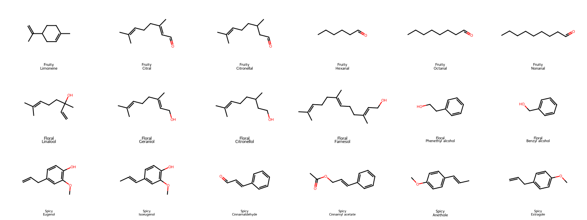
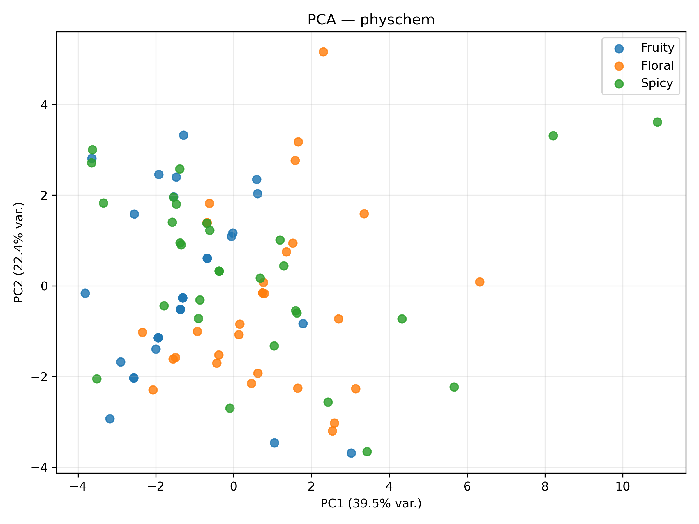
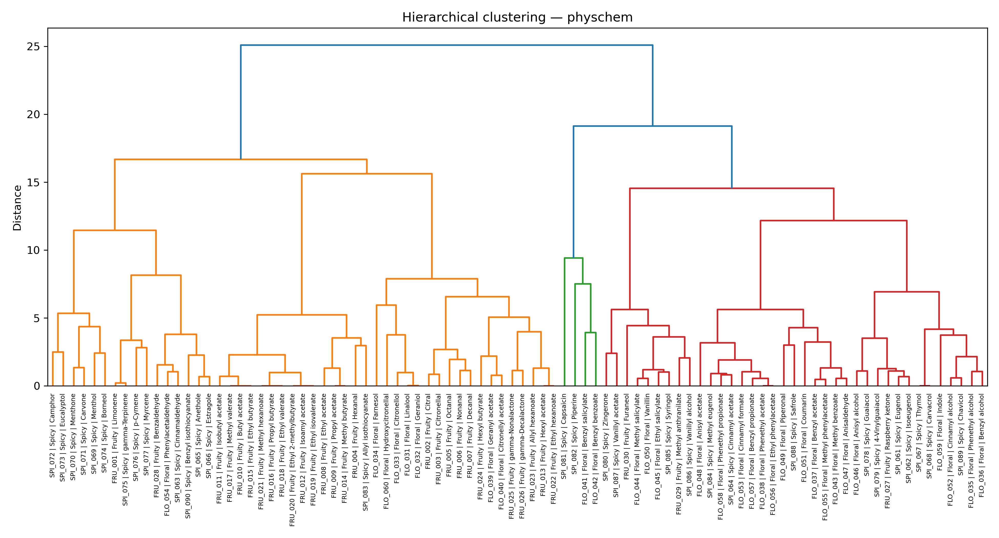

# Cheminformatics: does molecular representation change what "similar" means?

[](https://github.com/setsun-ai/cheminformatics-chemical-space/actions/workflows/ci.yml)

**MSc coursework.** Exploratory cheminformatics on two 90-molecule datasets: fragrance molecules (floral, fruity, spicy) and over-the-counter drugs from PubChem. The same molecules are encoded three ways (RDKit physicochemical descriptors, MACCS keys, Morgan fingerprints) and compared with PCA, t-SNE, UMAP and hierarchical clustering.



## Context & motivation

Virtual screening and analogue searches rest on the similarity principle: similar structures tend to have similar properties. But "similar" depends on the representation. Physicochemical descriptors compare overall size, polarity and lipophilicity. Substructure keys (MACCS) and circular fingerprints (Morgan/ECFP) compare which fragments are present. Two molecules can be neighbours in one space and far apart in another, which changes which compounds a screen would retrieve.

The project trained an open-ended data-exploration workflow:
- assemble and clean a dataset,
- choose complementary representations,
- explore the structure of the data with unsupervised methods,
- judge how sensitive the picture is to the representation and to hyper-parameters.

The test case is whether an everyday, non-structural label (odour class, therapeutic group) is reflected by molecular structure at all.

## Key result (fragrance dataset)

| Representation | PC1 + PC2 variance | ARI (HCA k = 3 vs class) | Silhouette (true classes) |
|---|---|---|---|
| Physchem (RDKit, scaled) | 61.9 % | 0.158 | 0.079 |
| MACCS (Jaccard) | 39.9 % | 0.001 | 0.100 |
| Morgan r2, 2048 bits (Jaccard) | 20.1 % | 0.014 | 0.061 |

**Odour class is only weakly encoded by structure.** Physicochemical descriptors separate the classes best, and the fingerprint spaces scatter them. Fingerprints spread their variance over many dimensions: the first two PCs of the Morgan space explain only 20 %, so 2D maps of fingerprint space need non-linear methods (t-SNE, UMAP) and careful interpretation.

<p>


</p>

## Method

| Step | Fragrance dataset | Home-pharmacy dataset |
|---|---|---|
| Data | 90 molecules, 3 odour classes × 30, SMILES validated with RDKit, no duplicate structures | 90 APIs, 3 therapeutic groups × 30 (pain, respiratory, gastro), SMILES/CIDs fetched from PubChem |
| Cleaning | RDKit sanitisation, canonical SMILES | salt stripping, largest fragment, uncharging |
| Representations | 16 scaled RDKit physchem descriptors; MACCS (167 bits); Morgan r = 2 (2048 bits) | continuous + topological descriptors; Morgan (1024 bits); MACCS |
| Exploration | PCA, t-SNE (perplexity 5/15/30), UMAP (n_neighbors 5/15/30, min_dist 0.1/0.5), HCA (Ward/Euclidean for physchem, Jaccard for fingerprints) | Orange Data Mining workflow ([`orange/home_pharmacy_projekt.ows`](orange/home_pharmacy_projekt.ows)) |
| Evaluation | ARI/NMI of HCA clusters vs class, silhouette, 2D structure grids, 3D SDF for Jmol | – |

A third, smaller exercise is a PCA/HCA analysis of the UCI Wine dataset in Orange ([`reports/PCA_HCA_report.pdf`](reports/PCA_HCA_report.pdf), Polish).

## How to run

```bash
pip install -r requirements.txt
python fragrance/chemoinf_fragrance_analysis.py                  # ~25 s, writes fragrance/results/
python home_pharmacy/home_pharmacy_cheminfo_project_v5.py        # rebuilds the CSVs; offline thanks to the PubChem cache
pytest                                                           # smoke tests (requirements-dev.txt)
```

**Reproducibility check (2026-10-05).** A fresh run reproduces every quantitative table exactly: descriptors, PCA variance, HCA clusters, ARI/NMI and silhouette. The run report text is identical. Only the **t-SNE and UMAP coordinates** differ from the committed ones. These embeddings are not bit-reproducible across library versions even with a fixed `random_state`, so the committed plots are kept and the maps should be read qualitatively.

## Validation & limitations

- 90 molecules per dataset, chosen by hand for the course, so they are not a random sample of chemical space.
- ARI/NMI against the class label measure agreement with one labelling only. Low ARI does not mean the clusters are meaningless; they may follow scaffold families instead of odour.
- t-SNE and UMAP distances between clusters are not interpretable, and the maps change with perplexity and `n_neighbors` (all variants are saved in `fragrance/results/`).
- Odour perception depends on receptor biology that 2D descriptors do not capture.

## Repository structure

```
fragrance/            pipeline script, input dataset, results (tables, PCA/t-SNE/UMAP/HCA plots, 2D grids, 3D SDF)
home_pharmacy/        PubChem fetch + RDKit standardisation script, Orange-ready CSVs, PubChem cache
orange/               Orange Data Mining workflows
reports/              PCA/HCA report on the Wine dataset (PL)
exploration/          earlier descriptor and PubChem scripts
tests/                smoke tests
```

## Data

All inputs are public:
- **Structures:** PubChem (NCBI), via PUG-REST. The fetch status log and cache are in `home_pharmacy/data_home_pharmacy_v5/`.
- **Fragrance list:** compound names and SMILES compiled for this project from public sources (`fragrance/data/fragrance_dataset.csv`).
- **Wine dataset:** the UCI Wine dataset as bundled with Orange.

## Scope

- **Set by the course:**
  - 3 groups of 30 molecules, related but not trivially similar,
  - 3 descriptor families (at least one continuous, at least one fingerprint),
  - an independent variable for interpretation (e.g. logP, size),
  - hypotheses stated up front,
  - exploration with the methods taught (PCA, t-SNE/UMAP, HCA, Orange),
  - a 15-minute presentation covering representation choice, sensitivity to hyper-parameters, interpretation and limitations.

  2D/3D structure visualisation and ChemBERTa embeddings were optional extensions.
- **My decisions:**
  - the two datasets and their class definitions,
  - the specific representations and distance metrics,
  - the quantitative separability metrics (ARI/NMI, silhouette),
  - automating the whole exploration in one reproducible script,
  - the 2D grids and 3D SDF export,
  - the PubChem standardisation with caching.

## AI usage

AI-assisted development was used for implementation and documentation. Method choice, validation strategy, data-handling decisions, result verification and interpretation were reviewed and owned by me. Specifically, I selected the molecule sets, checked structures and duplicates, compared the representations and judged which patterns were artefacts of the embedding method.

## License

Code: MIT (see [LICENSE](LICENSE)). PubChem-derived structures and data follow PubChem's terms of use.

---

## 🇵🇱 Opis po polsku

Projekt z przedmiotu *Chemoinformatyka* (kierunek InfoBioChem, studia II stopnia, Politechnika Gdańska, 2026). Sprawdzam, jak wybór reprezentacji cząsteczki zmienia to, co uznajemy za „podobne”. Ma to znaczenie w virtual screeningu i w poszukiwaniu analogów.

1. **Zapachy:** 90 cząsteczek w 3 klasach zapachowych. Porównanie deskryptorów fizykochemicznych, MACCS i Morgan w PCA, t-SNE, UMAP i HCA. Klasa zapachowa jest tylko słabo zakodowana w strukturze; najlepiej rozdzielają ją deskryptory fizykochemiczne (ARI 0,158).
2. **Domowa apteczka:** 90 substancji czynnych z PubChem, standaryzacja w RDKit, deskryptory i fingerprinty do analizy w Orange. Dane odtwarzają się offline z zapisanego cache.
3. **Raport PCA/HCA** dla zbioru Wine, wykonany w Orange.

**Uruchomienie:** `python fragrance/chemoinf_fragrance_analysis.py`, a testy przez `pytest`. Współrzędne t-SNE/UMAP mogą się różnić między wersjami bibliotek; wszystkie liczby (PCA, HCA, ARI) odtwarzają się dokładnie.

**Wsparcie AI:** kod i dokumentacja powstały z pomocą narzędzi AI. Wybór metod, decyzje dotyczące danych, weryfikacja i interpretacja wyników należały do mnie.
